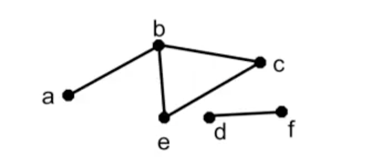
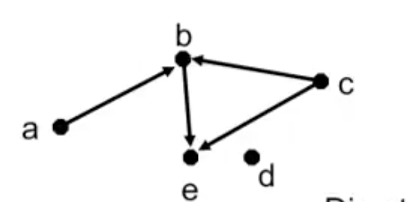
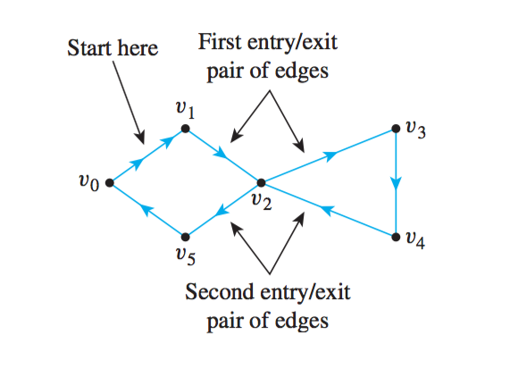

# Graph
A graph is a collection of vertices (Nodes) connected by edges (arcs)
A common abstract data type in CS.

## Simple Graph
A simple graph with no 'self loops' and at most one edge between an two vertices.

Formally a graph G is a specified by a pair(V, E) where V is a finite set of vertices and E is a set of edges. Each edge species a pair of vertices that it connects.

V = {a, b, c, d, e}
E = {(a,b), (b,c), (c,e), (e,b)} -> Oreder is not matter 

## Directed Graphs
有向圖
A directed graphs (V, E) specifies a set of vertices V and directed edges E. A directed edge is an oredered pair of vertices (a, b) denoteing an edge "going from" vertex a to vertex b

V = {a, b, c, d, e}
E = {(a,b), (b,c), (c,e), (e,b)} -> Oreder matters (a,b) != (b,a)


## Vertex Degree
有多少個edges連向特定的點
The degree of a vertax v(denoted deg(v)) in an undirected graph is the number of edges adjacent to v.

 ```
    b
  / |  \
a   |    c
    e   d

 ```

 deg(a) = 1
 deg(b) = 3
 deg(e) = 1
 deg(c) = 1
 deg(d) = 0

 ### Handshaking Property
 在無向圖中，有幾個edge就有 2 * edge 個 degree 總和。

 If an undirected graph(V, E) has e edges, then
 2 * e = sum of whole deg(v)

there are 3 edges in above graph, so the sum of the degree is 6 = 1 + 3 + 1 + 1 + 0

### Proof by Handshaking Property
Any undirected graph must have an even number of vertices with odd degree. (Zero is considered as even)

(By contradiction) Assume for the sake of contradiction that graph  G has an odd number of vertices with odd degree.

sum of the deg(v) = deg(odd) + deg(even) = odd value + even value = odd value 

By Handshaking Property, the sum of the degree should be even not odd value

***
## Bipartite Graph
兩個Set之內的Node間，沒有互相連接
a Graph that can be divided to two sets of vertices V1 and V2 such that there are no edges between nodes in V1 or between nodes in V2.

```
V1     V2
O -----O
  \
   \ 
    \ 
     \
O ---- O
O ---- O
```
### Example
Vertices in V1 are a set of jobs
Vertices in V2 are a set of workers
edges represent assignments of workers to jobs

### How can we tell if a graph is bipartite?
A two coloring of a graph is an assignment of one of Two colors to each vertex.

A graph is bipartite if and only if it has a two coloring such that no two vertices connected by an edge have the same color.

### Proof (Two colloring)
P = 'graph G is bipartite'
Q = 'G has 2 - coloring without edges between same color nodes'

Need to prove both 1) P -> Q 2) Q -> P

1) P -> Q

Assume P is true. We know the graph could be divided into two set.
Color vectices in V1 red color and in V2 black.
And its clear that Q is true, all the same color in the same set.

2) Q -> P

Assume Q is true. There is a two coloring graph.
Let V1 contain red vertices and V2 contian black vertices.

We see that P is true


***

# Connectivity and Path

Can we get from one point to another?
Is there a relationship link between two people?
What connected groups does a person belong to?
Which one scientific paper influenced by another?

## Paths
從v0開始，連接到vn的路線。
A path from vertex v0 to vn is a sequence of edges that connect successive vertices in a sequence v0, v1, v2... vn. The path length is n.




1. (a, b), (b, c), (c, e)
2. (a, b), (b, c), (c, e), (e, b), (b, c), (c, e)


A path is "simple" if it does not have repeated deges. 

### Circuit

A "circuit" is a path that starts and ends with the same vertex.


- Simple Circuit: (b,c), (c,e), (e,b)
- Non-Simple Circuit: (b,c) (c,e) (e,b) (b,c) (c,e) (e,b)

## Simple Path Lemma
Lemma: If there is a path between vertices u and v in a graph, then there is a simple path between u and v.

P: There is a path between u and v
Q: There is a simple path between u and v

Need to prove P -> Q

Assume that P is true.

#### Case1: Path is simple. Then Q is True.
#### Case: Path is not simple.
We get a repeated path from u to v.
- (u,a) (a,v) (v,b) (b,a) (a,v)
- We repeated (a,v) twice. There is a "circuit".(Start at A and end up A)
- We can cut the circut out of the path and still get the path we want.

***

# Connectedness 
無向圖中，每兩點間都有一個Path連接，就是Connected.
An undirected graph is called connected if there is a path "between every pair of distinct vertices" in the graph.
有向圖中，strongly connected必須讓每個點都能有a到b與b到a的路徑。

## Connectedness Theorem
Undirected graph G is connected if and only if there is a simple path between each pair of vertices in G.

P = G is connected
Q = Simple path between each pair of distinct vertices in G

#### P -> Q
Assume P is true. Thus, there is a path between each pair of vertices.
Thus, by simple path Lemma, each pair has a simple path.
Q is true.


#### Q -> P

Assume that Q is true. Then there is a simple path between each pair of vertices. So, P is true by definitions of Connectedness.

***

## Directed Graph
A directed path in a directed graph G from vertex v0 to vn is sequence of edges that connect successive vertices(order matters) in a sequence v0, v1, v2...vn.



- Directed paths from a to e: (a,b) (b,e)
- No directed path from a to c
- No directed path form e to any vertex.


## Strongly Connected Directed Graph
A directed graph is strongly conected if for each pair of vertices there is a directed path from u to v and from v to u.

- Indicators of communities in social networks.

***

## Path, Trails, Circuits and Conectivity

| Name | Repeated Edge | Repeated Vertex | Starts and Ends at same point | Must contain at least one edge|
|------|---------------|-----------------|-------|-----|
| Walk | Allowed       | Allowed         | Allowed| No|
| Trail| No       | Allowed         | Allowed| No|
| Path | No       | No         | No |  No|

***

[Walks, Trails, Paths, Circuits](http://mathonline.wikidot.com/walks-trails-paths-cycles-and-circuits)

## Walks

Definition: For a graph G=(V(G),E(G)), a Walk is defined as a sequence of alternating vertices and edges such as v0,e1,v1,e2,...,ek,vk where each edge ei={vi−1,vi}. The Length of this walk is k.

Note that walks can have repeated edges.

## Open / Closed Walks

Definition: A walk is considered to be Closed if the "starting vertex is the same as the ending vertex", that is v0=vk. A walk is considered Open otherwise.

## Trails
A Trail is defined as a walk with no repeated edges.

## Paths
Definition: A Path is defined as an open trail with no repeated vertices.

Notice that all paths must therefore be open walks, as a path "cannot both start and terminate at the same vertex."

## Circuit
Definition: A Circuit is a "closed trail". That is, a circuit has no repeated edges but may have repeated vertices.

***
## Euler Circuirs

Let G be a graph. An Euler Circuit for G is a circuit that contins every vertex and every edge of G. That is, an Euler circuit for G is a sequence of adjacent vertices and edfes in G that has at least one edge, starts and ends at the same vertex, "uses every vertex of G at least once, and uses every edge of G exactly once".

### Proof

```
If a graph has an Euler circuit, then every vertex of the graph has positive even degree.
```

從其中一個終檢間點出發，走完一次圖，會發現每個點都經過一次，代表對每個點做進入與離開兩個動作，意味著有 2 indegree（兩個edges連接一個vertex)

Suppose G is a graph that has an Euler circuit. [We must show that given any vertex v of G, the degree of v is even.] 

Let v be any particular but arbitrarily chosen vertex of G. Since the Euler circuit contains every edge of G, it contains all edges incident on v. Now imagine taking a journey that begins in the middle of one of the edges adjacent to the start of the Euler circuit and continues around the Euler circuit to end in the middle of the starting edge. (See Figure 10.2.3. There is such a starting edge because the Euler circuit has at least one edge.) 

Each time v is entered by traveling along one edge, it is immediately exited by traveling along another edge (since the journey ends in the middle of an edge).

Because the Euler circuit uses every edge of G exactly once, every edge incident on v is traversed exactly once in this process. Hence the edges incident on v occur in entry/exit pairs, and consequently the degree of v must be a positive multiple of 2. But that means that v has positive even degree [as was to be shown].



***
## Required Reading
pp.  625-638 (Discrete Mathematics with Applications, Susanna S.Epp)
pp.  642-653 (Discrete Mathematics with Applications, Susanna S.Epp)

*** 
# Dijkstra’s algorithm

Edsgar Dijkstra, developed an algorithm to find the shortest path between a starting vertex and an ending vertex in a weighted graph in which all the weights are positive. It is somewhat similar to Prim’s algorithm in that it works outward from a starting vertex a, adding vertices and edges one by one to construct a tree T . However, it differs from Prim’s algorithm in the way it chooses the next vertex to add, ensuring that for each added vertex v, the length of the shortest path from a to v has been identified.

At the start of execution of the algorithm, each vertex u of G is given a label L(u), which indicates the current best estimate of the length of the shortest path from a to u. L(a) is initially set equal to 0 because the shortest path from a to a has length zero, but, because there is no previous information about the lengths of the shortest paths from a to any other vertices of G, the label L(u) of each vertex u other than a is initially set equal to a number, denoted ∞, that is greater than the sum of the weights of all the edges of G. As execution of the algorithm progresses, the values of L(u) are changed, eventually becoming the actual lengths of the shortest paths from a to u in G.

Because T is built up outward from a, at each stage of execution of the algorithm the only vertices that are candidates to join T are those that are adjacent to at least one vertex of T . Thus at each stage of Dijkstra’s algorithm, the graph G can be thought of as divided into three parts: the tree T that is being built up, the set of “fringe” vertices that are adjacent to at least one vertex of the tree, and the rest of the vertices of G. Each fringe vertex is a candidate to be the next vertex added to T . The one that is chosen is the one for which the length of the shortest path to it from a through T is a minimum among all the vertices in the fringe.

An essential observation underlying Dijkstra’s algorithm is that after each addition of a vertex v to T , the only fringe vertices for which a shorter path from a might be found are those that are adjacent to v [because the length of the path from a to v was a minimum among all the paths from a to vertices in what was then the fringe]. So after each addition of a vertex v to T , each fringe vertex u adjacent to v is examined and two numbers are compared: the current value of L(u) and the value of L(v) + w(v, u), where L(v) is the length of the shortest path to v (in T ) and w(v, u) is the weight of the edge joining v and u. If L(v) + w(v, u) < L(u), then the value of L(u) is changed to L(v) + w(v, u).

At the beginning of execution of the algorithm, the tree consists only of the vertex a, and L(a) = 0. When execution terminates, L(z) is the length of a shortest path from a to z.

## Algorithm Body

#### 1. Initialize T to be the graph with vertex a and no edges. Let V (T) be the set of
vertices of T, and let E(T) be the set of edges of T.

#### 2. Let L(a) = 0, and for all vertices in G except a, let L(u) = ∞.
[The number L(x) is called the label of x.] 

#### 3. Initialize v to equal a and F to be {a}.
[The symbol v is used to denote the vertex most recently added to T.]

#### 4. while (z ̸∈ V(T))

- 4a. 

F = (F − {v}) ∪ {vertices that are adjacent to v and are not in V(T)} 

[The set F is called the fringe. Each time a vertex is added to T, it is removed from the fringe and the vertices adjacent to it are added to the fringe if they are not already in the fringe or the tree T.]

- 4b. 

For each vertex u that is adjacent to v and is not in V (T), if L(v) + w(v, u) < L(u) then

L(u) = L(v) + w(v, u)
D(u) = v

[Note that adding v to T does not affect the labels of any vertices in the fringe F except those adjacent to v. Also, when L(u) is changed to a smaller value, the notation D(u) is introduced to keep track of which vertex in T gave rise to the smaller value.]

- 4c. 

Find a vertex x in F with the smallest label

Add vertex x to V(T), and add edge {D(x),x} to E(T)
v = x [This statement sets up the notation for the next iteration of the loop.]

#### end while


#### Output 
L(z) [L(z), a nonnegative integer, is the length of the shortest path from a to z.]

****

