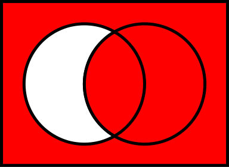

# Logic Expressions: Part 1

## Propositions
A proposition is a declarative statement.

We often use letters p, q, r, s …. to denote propositions.
T: true F: false

A statement(proposition) is a sentence that is true or false but not both.

## Negation Operator
The truth value of ¬p is the opposite of p.

- Let p be “Tom is a human”
- If p is True then ¬p is “Tom is not a human.”

## Conjunction Operator
The conjunction of p and q is p ∧ q.

- p ∧ q is true if and only if p and q are both true

## Disjunction Operator
The disjunction of p and q is p ∨ q. 

- p ∨ q is true if and only if p is true or q is true

## Exclusive Or
- ⊕: exclusive or : Only one side could be false
- (p v q) ∧ ~(p ∧ q) : When or is used in its exclusve sense, the statement "p or q" means "p or q but not both" or " p or q and not both p and q".

## Implication Operator
The proposition (or statement) p → q has a truth value for
any setting of p and q.

- “If tomorrow is sunny then John will go jogging.”
-     |----p-----------|     |---q---------------|
- We don't know what John will do tomorrow if it isn't a sunny day
- The proposition “p implies q” is written p → q.
- Meaning: “If p is true then q must be true”
- “If p is false then q could be either true or false”

|P|Q|P -> Q|
|-|-|------|
|T|T|T|
|T|F|F|
|F|T|T|
|F|F|T|

## Biconditional
The truth table for A <-> B also written as A ≡ B, A = B

|P|Q|R|P ≡ Q|-R|-R ⊕ Q |(P ≡ Q) v (-R ⊕ Q )|  
|-|-|-|-----|--|:-----:|:-----------------:|
|T|T|T|T    |F |T      |T           |
|T|T|F|T    |T |F      |T           |
|T|F|T|F    |F |F      |F           |
|T|F|F|F    |T |T      |T           |
|F|T|T|F    |F |T      |T           |
|F|T|F|F    |T |F      |F           |
|F|F|T|T    |F |F      |T           |
|F|F|F|T    |T |T      |T           |

## Equivalency Truth Table

|P|~P|Q|~Q|R|(Q->R)|(P -> (Q->R)|(~Q vR)|~P v(~QvR)|P ≡ Q|P ⊕ Q| P ∨ Q | P ∧ Q |  
|-|--|-|--|-|:----:|:----------:|:-----:|:--------:|:---:|:---:|:-----:|:-----:|
|T|F |T|F |T|T     |T           |T      |T         |T    |F    |T      |T      |
|T|F |T|F |F|F     |F           |F      |F         |T    |F    |T      |T      |
|T|F |F|T |T|T     |T           |T      |T         |F    |T    |T      |F      |
|T|F |F|T |F|T     |T           |T      |T         |F    |T    |T      |F      |
|F|T |T|F |T|T     |T           |T      |T         |F    |T    |T      |F      |
|F|T |T|F |F|F     |T           |F      |T         |F    |T    |T      |F      |
|F|T |F|T |T|T     |T           |T      |T         |T    |F    |F      |F      |
|F|T |F|T |F|T     |T           |T      |T         |T    |F    |F      |F      |


## Logic Symbols
≥ ≤ ≠ ¬ ∧ ∨ ⊕ ≡ → ↔ ∃ ∀ ( You can use either ~ or ¬ as negation symbol )

## Set Symbols
∈ ∉ ⊆ ⊂ ⊇ ⊃ ∅ ∪ ∩ ×

## Logic Expression Example
1. If the patient is an infant then the patient has no children

- p: patient is an infant
- q: patient has child
- p -> -q

2. The file is either read-only or it is not read-only but is a copy.
- p: file read only
- -p: file not read only
- q: file is copy
- p v (-p ∧ q)

3. Bob is either rich or humble, but Bob is not humble if he is rich.
- but tranfer as and
- p: Bob is humble
- q: Bob is rich
- (p v q) ∧ (q -> -p)

## Logic Expression Example 2 (to English)
```
p: Today is Monday
q: It is raining
r: It is hot
```
1. -p -> (q v r)
- If today is not Monday, then it is raning or hot.

2. -(p v q) <-> r
- <-> if and only if
- It is not the case that it is Monday or it is raining, if and only if it is hot.

## Required Reading 
Chapter 2 ( Discrete Mathematics with Applications (4th Edition), Susanna S. Epp) Page : 23-36 ( You must try all the example problems from the book) 

***

# Table of Logical Equivalences
| Laws| a | b | Time to Use|
|-----|---|---|------------|
|Commutative| p ∧ q ≡ q ∧ p | p ∨ q ≡ q ∨ p | 變pq順序 |
|Associative| (p ∧ q) ∧ r ≡ p ∧ (q ∧ r) | (p ∨ q) ∨ r ≡ p ∨ (q ∨ r)|移動pqr相對位置|
|Distributive| p ∧ (q ∨ r) ≡ (p ∧ q) ∨ (p ∧ r)| p ∨ (q ∧ r) ≡ (p ∨ q) ∧ (p ∨ r)| 簡化邏輯式，或展開邏輯|
|Identity| p ∧ T ≡ p | p ∨ F ≡ p | and T / or F 不改變自身TF |
|Domination| p ∨ T ≡ T | p ∧ F ≡ F| or T / and F 改變自身為 T F |
|Negation| p∨ ∼ p ≡ T | p∧ ∼ p ≡ F | q 和 ~q -> 不可能 / q 與 ~q -> T |
|Double Negative| ∼ (∼ p) ≡ p | | 抵銷~ |
|Idempotent| p ∧ p ≡ p  | p ∨ p ≡ p| 重複 p and p / p or p|
|De Morgan’s| ∼ (p ∧ q) ≡ (∼ p) ∨ (∼ q) | ∼ (p ∨ q) ≡ (∼ p) ∧ (∼ q)|將~放入其中，改變and / or |
|Absorption| p ∨ (p ∧ q) ≡ p | p ∧ (p ∨ q) ≡ p| 簡化被覆蓋的部分 |
|Conditional| (p -> q) ≡ (∼ p ∨ q)  | ∼ (p -> q) ≡ (p ∧ ∼ q)| 條件轉換，前面~ 與後面 |

De Mogran : should change either V or ∧ to the opposite one.
- ~(P v ~Q)  ≡ ~P ∧ Q

Conditional: p -> q ≡ (~p v q) 


The red area describes all members for which the material conditional is true, and the white area describes all members for which it is false. The material conditional differs significantly from a natural language's "if...then..." statement. It is only false when both the antecedent {\displaystyle A} A is true and the consequent {\displaystyle B} B is false.

- 只要 p 是 Fales，不論q是True or False，結果皆為True T
- 但當 p 是 True時，只有q是True，結果才為True

***

# Logic Expressions: Part 2

## Testing whether two statements forms P and Q are logically Equivalent
1. Construct a truth table with one column for the truth values of P and another column for the truth values of Q.
2. Check each combination of truth values of the statement variables to see whether the truth value of P is the same as the truth value of Q.

## De Morgan's Law
The negation of an "and" statement is logically equivalent to the "or" statement in which each component is negated.
The negation of an "or" statement is logically equivalent to the "and" statement in which each component is negated.

John is 6 feet tall and he weights at least 200 pounds.
- p: is 6 feet
- Q: is at least 200 pounds
- -> P ^ Q -> ~P V ~Q

John is not 6 feet tall or he weights less than 200 pounds

The bus was late or Tom's watch was slow
- The bus was not late and Tom's watch was not slow.

## The Negation of Conditional Statement

The negation of “if p then q” is logically equivalent to “p and not q”

~(p -> q) ≡ ~ ( ~p ∨ q) ≡ p ∧ ~q


## Example
- Example 1:

```
Show that ∼(p ∨ ∼q) ∨ (∼p ∧ ∼q) ≡ ∼p.
L.H. S = ∼(p ∨ ∼q) ∨ (∼p ∧ ∼q) 1. De Morgan’s law
 ≡ (∼p ∧ ∼(∼q)) ∨ (∼p ∧ ∼q) 2. Double negation law
 ≡ (∼p ∧ q) ∨ (∼p ∧ ∼q) 3. Distributive law
 ≡ (∼p ∧ (q ∨∼q) ) 4. Negation law
 ≡ (∼p ∧ t ) 5. Identity law
 ≡ ∼p 
```

- Example 2:

```
Show that ∼ (q → p) ∨ (p ∧ q) ≡ q.
L.H.S = ∼ (q → p) ∨ (p ∧ q) 1. Implication / conditional equivalence
 ≡ ∼ (∼q ∨ p) ∨ (p ∧ q) 2. De Morgan’s law
 ≡ (∼ (∼q) ∧ ∼p) ∨ (p ∧ q) 3. Double negation law and commutative law (p ∧ q)
 ≡ (q ∧ ∼p) ∨ (q ∧ p) 4. Distributive law 
 ≡ (q ∧ (∼p ∨ p)) 5. Negation law
 ≡ (q ∧ T ) 6. Identity law
 ≡ q 
```

- Example 3:

```
Show that (p ∨ ∼q) ∧ (∼p ∨ ∼q) ≡∼q

(p ∨ ∼q) ∧ (∼p ∨ ∼q) 1. Commutative law
≡ (∼q ∨ p) ∧ (∼q ∨ ∼p) 2. Distributive law
≡ ∼q ∨ (p ∧ ∼p) 3. Negation law
≡ ∼q ∨ c 4. Identity law
≡ ∼q 
```
- Example 4:

```
L.H. S = (p ∧ q) → (p ∨ q) 1. Implication equivalence
≡ ∼ (p ∧ q) ∨ (p ∨ q) 2. De Morgan’s law
≡ (∼ p ∨ ∼ q) ∨ (p ∨ q) 3. Associative law
≡ (∼ p ∨ ∼ q ∨ p) ∨ q 4. Commutative law
≡ (∼ p ∨ p ∨ ∼ q) ∨ q 5. Associative law
≡ (∼ p ∨ p) ∨ (∼ q ∨ q) 6. Negation law
≡ t ∨ t 7. Idempotent law
≡ t, It’s a tautology
```

- Example 5:
```
L.H.S = (p∧q) → p 1.Implication equivalence
≡ ∼ (p∧q) ∨ p 2. De Morgan’s law
≡ ( ∼ p∨∼ q) ∨ p 3. Commutative law
≡ ( ∼ q∨∼p) ∨ p 4. Associative law
≡ ∼q∨ (∼p ∨ p) 5. Negation law
≡ ∼q∨ t 6. Universal bound law
≡ t , it’s a tautology.
```

- Example 6:
```
Show that ∼ ((∼p ∧ q) ∨ (∼p ∧ ∼q)) ∨ (p ∧ q) ≡ p.
L.H.S = ∼ ((∼p ∧ q) ∨ (∼p ∧ ∼q)) ∨ (p ∧ q) 1. De Morgan’s law
≡ (∼ (∼p ∧ q) ∧ ∼ (∼p ∧ ∼q)) ∨ (p ∧ q) 2. De Morgan’s law
≡ (∼(∼p) ∨ ∼ q) ∧ ((∼(∼p) ∨ ∼ (∼ q) ) ∨ (p ∧ q) 3. Double negation law
≡ ((p ∨ ∼ q) ∧ (p ∨ q)) ∨ (p ∧ q) 4. Distributive law
≡ ((p ∨ (∼ q ∧ q)) ∨ (p ∧ q) 5. Negation law
≡ (p ∨ c) ∨ (p ∧ q) 6. Identity law
≡ p ∨ (p ∧ q) 7. Absorption law
≡ p
```

- Example 7:
```
Show that (p → q) \/ (p → r) and p → (q \/ r) are logically equivalent.
L.H.S = (p → q) \/ (p → r) 1. Implication Equivalence
≡ (∼p \/ q) \/ (∼p \/ r) 2. Associative law
≡ ∼p \/ q \/ ∼p \/ r 3. Commutative law 
≡ ∼p \/∼p \/ q \/ r 4. Idempotent law
≡ ∼p \/ (q \/ r) 5. Implication law
 ≡ p → q \/ r , they are logically equivalent.
```

- Example 8:
```
Show that ∼ (p ∨ (¬p ∧ q)) ≡ (∼p ∧ ∼q) ∨ c.
L.H.S = ∼ (p ∨ (¬p ∧ q)) 1. De Morgan’s law
 ≡ ∼p ∧ ∼ (∼p ∧ q) 2. De Morgan’s law
 ≡ ∼p ∧ [∼ (∼p) ∨ ∼q] 3. Double negation law
 ≡ ∼p ∧ (p ∨ ∼q) 4. Distributive law
 ≡ (∼p ∧ p) ∨ (∼p ∧ ∼q) 5. Negation law
 ≡ c ∨ (∼p ∧ ∼q) 6. Commutative law
 ≡ (∼p ∧ ∼q) ∨ c 7. Identity law
 ≡ ∼p ∧ ∼q 
```

## Required Reading
Chapter 2 ( Discrete Mathematics with Applications (4th Edition), Susanna S. Epp) Page : 39-48 ( You must try all the example problems provided in the book) 


*** 
# Logic Expression Part 3

If the patient is an infant, then the patient has no children

- Propostitional logic:
- AlexIsInFant -> ~ AlexHasChild 
- This expression is only about Alex!
- What is we want to make this assertion about all patients. (In Database for example)

If any patient is an infant, then that patient has no children.
- Propostiional logic can't express such statements
- We need to make a statement "arbitary" patients

## Predicate Symbol
Propostitional funciton with one or more argument 
- Infant(x): is ture if and only if x is an infant
- HasChild(x): is true if and only if x has a child

If Alex is an infant, then Alex has no children
- Infant(Alex) -> ~HasChild(Alex)
- But the statement is only but Alex still

## Universal Quantifier (∀ : For All x) Everyone!
If any patient is an infant, then the patient has no childern
- x is an arbitary patient
- ∀x Infant(x) -> ~HasChild(x)
- ∀: Read as for all x
- x is restricted to a domain of discourse(here patients)

For all x, where x is a patient, if x is an infant, then x does not have a child.

## Existential Quantifier (∃ : There exist an x) Someone!
There exists a patient that is an infant and has the flu.

- Talk about the existance of Object.
- ∃x Infant(x) ^ HasFlu(x)
- ∃: Read as there exists an x
- x is restricted to domain(here patients)

There exists an x, where x is patient, such that x is an infant and x has the flu.

## Negating Quatifier
#### Statements equivalent:

Not all patient are infants.
- ~(∀x Infant(x)) 

There exists a patient that is not an infant.
- ∃x ~Infant(x)

### Other example 
There does not exist a patient that is an infant
- ~(∃x Infant(x))

For all patient, none of them are infant.
- ∀x ~Infant(x)

### In general (Similar to De Morgan's Laws)
~(∀x P(x)) ≡ ∃x ~P(x)
~(∃x P(x)) ≡ ∀x ~P(x)


***

# Quatifier Example
P(x): x is a professional basketball player
B(x): x plays basketball

Assume the domain of discourse is all people

#### ∀xP(x) -> B(x)

For every person, if that person is a professional basketball players, then he or she 
plays baketball.

Every professional basketball player plays basketball.

#### ∃x P(x) -> B(x)

There is a person such that if the persion is a professional basketball player then they play basketball.

- This is not usual goint to find

#### ∃x P(x) ^ B(x)

There exists a person that is a professional basketball player and plays basketball

- More typical pattern

#### ∀x (P(x) V B(x))

Everyone is either a professional basketball player or plays basketball


## Translate the statement in defferent domains

### Example 1
Someone in your school has visited Disney.
Domain 1 : all people in your school
Domain 2 : all people

#### Domain1: 
- Visited(x,y): x visited y
- ∃x Visited(x, Disney)

#### Domain2:
- We need to have a new condition
- S(x) x is somebody in your school
- ∃x S(x) ^ visited(x, Disney)

### Example 2
Everyone in your school was vorn in the twentieth century.

Domain1: All people in your school
Domain2: All people

#### Domain1:
- WasBorn(x, y): x was born in y century
- ∀x WasBorn(x, twentieth)

#### Domain2:
- S(x) x is somebody in your school
- ∀x (S(x) ^ WasBorn(x,twentieth))

### Example 3
Everyone in your class has studied Cal or Program

#### Domain1:
- Class(x) : somebody in your class 
- Study(x, y) : x study y
- ∀x Class(x) -> (Study(x, cal) V Study(x, program))

### Domain2:
- Class(x) : somebody in your class (Also in your school)
- Study(x, y) : x study y
- ∀x Class(x) -> (Study(x, cal) V Study(x, program))


### Example 4
There is a person in your school who is not happy.

#### Domain1:
- ∃x ~Happy(x)

#### Domain2:
- School(x) : somebody in your school
- ∃x (School(x) ^  ~Happy(x))

### Example 5
No one in your school owns both a motorcycle and bicycle.

#### Domain1:
- ∀x ~(Own(x, moto) ^ Own(x, bike))
- ~∃x (Own(x,moto) ^ Own(x, bike))

#### Domain2: There is a conditional of students in our school
- Why wrong: ∀x  ~(School(x) ^ Own(x, moto) ^ Own(x, bike))
- Nobody in the word are both in our school and doesn't own moto and bike

- ∀x School(x) -> ~(Own(x, moto) ^ Own(x, bike))
- This tells In our school, nobody own a mot and bike
- ~∃x (School(x) -> ~(Own(x, moto) ^ Own(x, bike)))

***
## Required Reading 
pp. 96-105 , 109-111 ( Discrete Mathematics with Applications, Susanna S.Epp)
