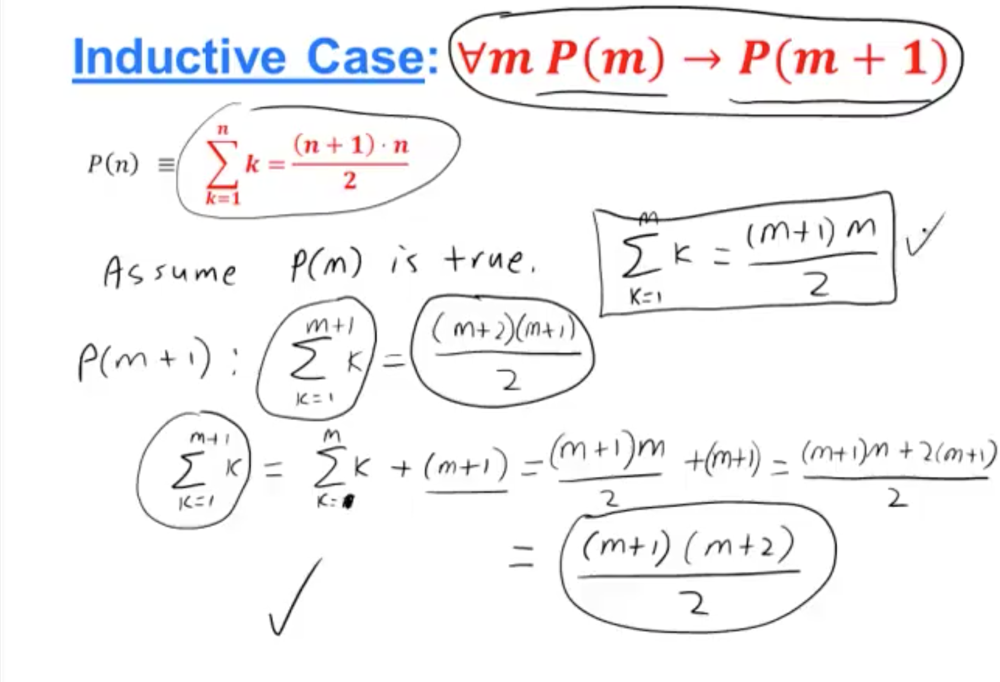

# Induction Proof

1. Basic Case: prove P(0) or P(1) (depends on the domain)
2. Prove the implication Vn P(n) -> P(n+1)



## Question 16
```
Using strong mathematical induction to prove that for any integer n >= 2, if n is even, then any sum of n odd integers is even.

Use strong mathematical induction to prove your conjecture.

P(n) is the statement in the problem, now we need to prove P(n) is true and when P(2) and P(4) and … P(k-1) are all true then P(k+1) is True. 

1)	Basic Case:
For n = 2, sum of two odd integers is even.
Assume there are a and b two odd integers. There exist integers r, s such that a = 2r + 1, b = 2s + 1.  So, a + b = 2(r + s + 1) which is an even integer.

So we prove the P(2) is True.

2)	Inductive Case:
For any integers k >= 2, assume that for all integers i, 2 <= I <=k, P(i) is true. We now need to prove that P(i+1) is true.

Let a1, a2, … ak, ak+1 be k+1 odd integers.

If k is odd, them by the induction hypothesis, (a1+a2+…+ak) is an odd number, and we know odd number plus odd number will be an even number, so, a1+a2+…+ak + a(k+1) is an even number.

In this case, P(n+1) is true. If k is even and k >= 4, then k – 1 will be an odd number and k – 1 > 2, so by correctness of P(k-1), the sum of those k-1 odd integers is an odd number.

Combining both the cases, P(k+1) is true for any integer k >= 2. Thus, by strong induction, P(n) is true for all integer n >= 2.

Both Basic and Inductive Case are proved, so we can say the statement is True.

```

***

# Weak Induction


***

# Strong Induction