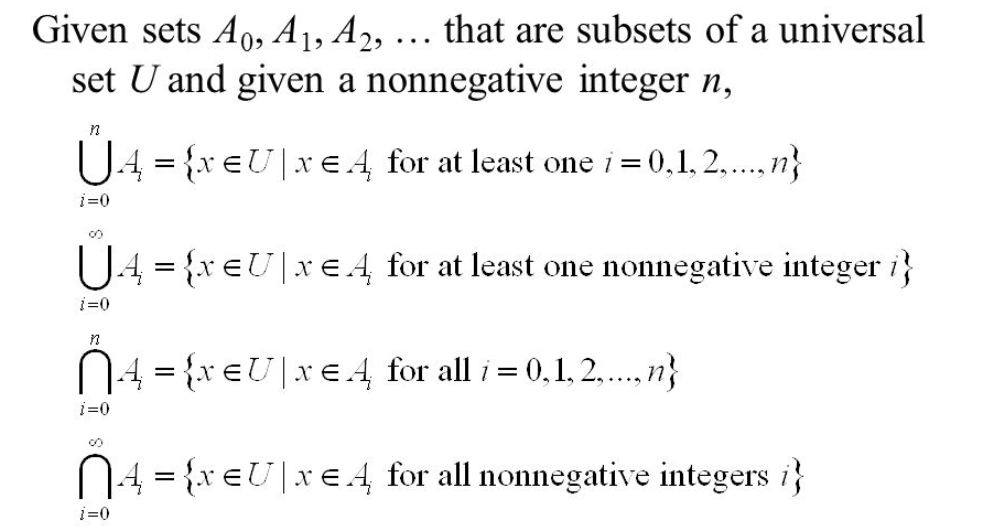
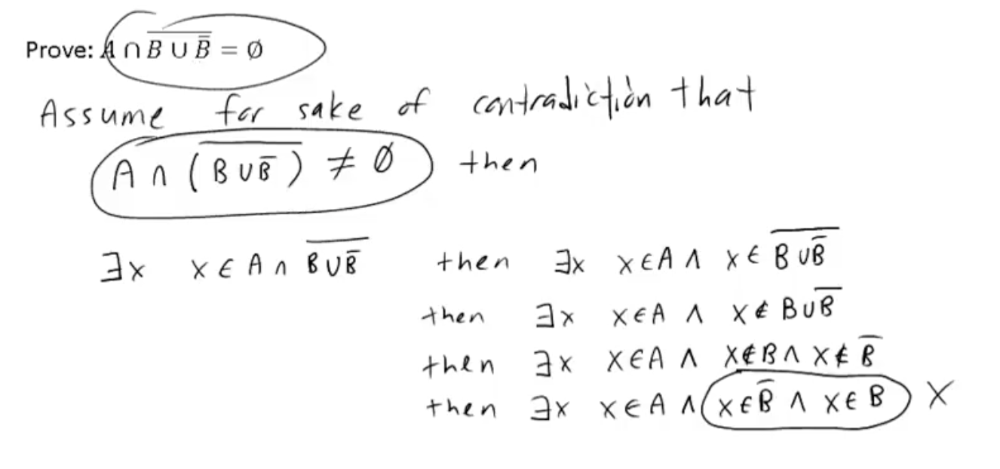
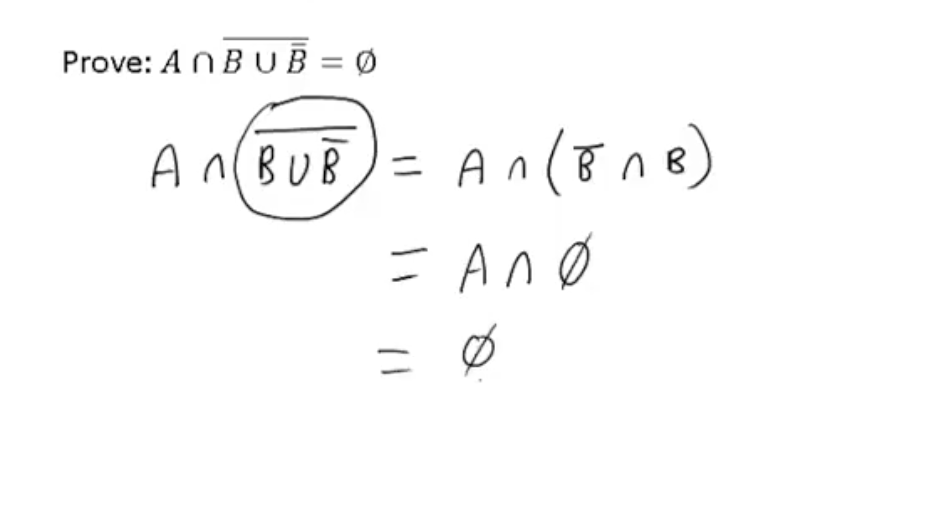

# SET Theory


## Definitions and the Element Method of Proof

x is an element of S.

If S is a set and P(x) is a property that elements of S may or may not satisfy, then a set A may be defined by writing:

```
A = {x ∈ S | P(x)}
```

- The set of all x in S such taht P of x

***

## Subsets: Proof and Diproof

### set A to be a subset of a set B as formal universal conditional statement:

```
A ⊆ B <=> ∀x, if x ∈ A then x ∈ B
```

### The negation is:

```
A ⊊ B <=> ∀x, if x ∈ A then x ∉ B
```

### A proper subset of a set is a subset that is not equal to its containing set. Thus

```
A is a proper subset of B <=>
  1) A ⊆ B and,
  2) There is at least one element in B that not in A
```

## Basic Method for proving That one set is subset of another
Let sets X and Y be given. To prove that X ⊆ Y,
1. Suppose that x is a particular but arbitrarily chose element of Y.
2. Show that x is an element of Y.

### Proving and Disproving Subset Relations
Define sets A and B as fellows:

A = {m ∈ Z | m = 6r + 12 for some r ∈ Z }
B = {n ∈ Z | n = 3s for some s ∈ Z }

### Proof that A ⊆ B
Suppose x is a particular but arbitratily chosen element of A.
- [By definition of B, We must show that x = 3 * some integer. ]

By definition of A, there is an integer r such that x = 6r + 12
- [Does 6r + 12 = 3 * some integer?]

Let s = 2r + 4
- [We must check that s is an integer!]

Then s is an integer because products and sums of integers are integers.
- [Now we must check that x = 3s]

Also 3s = x
Thus, by definition of B, x is an element of B.


***

## Set Equality
Given sets A and B, A equals B, written A = B, if and only if every element fo A is in B and every element of B is in A.

```
A = B <=> A ⊆ B and B ⊆ A
```

Define sets A and B as fellows:

A = {m ∈ Z | m = 2a for some integer a }
B = {n ∈ Z | n = 2b - 2 for some integer b}

### Proofs
#### Proof That A ⊆ B
Suppore x is a particular but arbitrarily chosen element of A.
- [We must show taht x ∈ B, by definition of B, this means we need to show x = 2 * someinteger - 2]

By definition of A, there is an integer a such that x = 2a
- [Given that x = 2a, can x also be expressed as 2 * some integer - 2? b = (2a + 2)/2 = a + 1]
- [讓 x = 某個數 * 2 - 2，等於變成 2b - 2的格式]
- [x = I * 2 - 2]
- [直接讓 x = 2a = 2b - 2 || 得到 b = a + 1]
- [所以當 b = a + 1的時候，x可能為B的element，我們接著要證明 b 是 Integer]

Let b = a + 1
Then b is an integer because it is a sum of integers.
- [再把b放回n當中檢查，是否等於x]

Also 2b - 2 = 2(a+1) - 2 = 2a = x
Thus, by definition of B, x is an element of B.

***

## Operations on Sets
- The union of A and B: A ∪ B
- The intersection of A and B: A ∩ B
- The defference of B minus A(or relative complement of A in B): set of all elements that are in B and not A
- The complement of A, is the set of all elements in U that are not in A.

### Notation

- (a,b) = {x ∈ R | a < x < b}
- (a,b] = {x ∈ R | a < x <= b}
- (a,∞) = {x ∈ R | a > x }


### Unions and Intersections of an Indexed Collection of Sets
"The Union of the A-sub-i from i equals zero to n"




### Finding Unions and Intersections of More than Two Sets
For each postive integer i let Ai = { x ∈ R | -(1/i) < x < 1/i} = Ai = (-(1/i) * 1/i)

#### Find A1 U A2 U A3 and A1 ∩ A2 ∩ A3
1. Since all the elements in (-1/3, 1/3) and (-1/2, 1/2) are in (-1, 1): Ansewer is (-1, 1)
2. Answer is (-1/3, 1/3)

```
-|-----|------|----|---|-----|------|--
-1  -1/2    -1/3   0  1/3    1/2    1
```

##### Find U i = 1 to ∞ and ∩ i = 1 to ∞

1. = A1 U A2 U A3 U... A∞ = (-1, 1)

2. = A1 ∩ A2 ∩ A3 ∩... A∞ = (-1/ ∞, 1/ ∞) = {0}

***

## The Empty Set

Two set are called disjoint if and only if they have no elements in common.

```
A ∩ B = ∅ 
```

#### Mutually Disjoint Sets
Let A1 = {3,5} A2 = {1,4,6} and A3 = {2} 
Since they hace no elements in common, thry are mutually disjoint.

***

## Power Set
A set of all subsets.
∅ is an element in every set.

```
p({x,y}) = {∅,{x},{y},{x,y}}
```

***

## Cartesian Products

### ordered n-tuple
Recall that the definition of a set is unaffected by the order in which its elements are listed or the fact that some elements may be listed mroe than once.

Thus, {a,b},{b,a},{a,a,b} are all the same set!

The notaion for an ordered n-tuple is a generalization of the notaion for an ordered pair. It took both order and multiplicity into account.

```
(x1, x2, x3 ... xn) = (y1, y2, y3, ... yn)
when x1 = y1, x2 = y2 ... xn = yn
```

### Cartesian Products

Let A1 = {x,y}, A2 = {1,2,3} and A3 = {a,b}

- Find A1 x A2 = {(x,1),(x,2),(x,3),(y,1),(y,2),(y,3)}
- Find (A1 x A2) X A3 = {((x,1),a),((x,2),a),((x,3),a),((y,1),a)...((y,3),b)}
- Find A1 X A2 X A3 = {(x,1,a),(x,2,a),(x,3,a),(y,1,a),(y,2,a),(y,3,a),(x,1,b),(x,2,b),(x,3,b),(y,1,b),(y,2,b),(y,3,b)}


*** 

## Example

B = {y ∈ Z | y = 18b – 2 for some integer b}
C = {z ∈ Z | z = 18c + 16 for some integer c}

c) B = C
	
True.

```
When B = C means B⊆   C and C ⊆   B

Prove B⊆   C 

Suppose k is an element of C.
By the definition of C, there is an integer a such that k = 18c + 16.

Let b = c + 1
Also,18b – 2 = 18(c+1) – 2 = 18c + 18 – 2 = 18c + 16 = k

Which means k ∈ B, C is a subset of B.

Prove C ⊆   B

Suppose k is an element of C.
By the definition of C, there is an integer a such that k = 18c + 16.

Let b = c + 1
Also,18b – 2 = 18(c+1) – 2 = 18c + 18 – 2 = 18c + 16 = k

Which means k ∈ B, C is a subset of B.

Since B⊆   C and C ⊆   B, prove B = C.
```

***

# Set Opeartion

### Union
Set A and B(A U B) us the set that contains the elements that are in either A or B(or both)

```
A U B = {x|x ∈ A ∨ x ∈ B }
```

### Intersecion 
Set A and B (A ∩ B) is the set that contains the elements that are in both A and B

```
A ∩ B = {x|x ∈ A ∧ x ∈ B }
```

#### Cardinalities of Union

|A| + |B| - A ∩ B = A U B 

### Difference
Ser A and B(A - B) is the set that conatins all the element in A but not in B

```
A - B = {x|x ∈ A ∧ x ∈\ B }
```

### Complement 
      
Set x (x̅) is the set that contains exactly all the element that are not in A.

### Set Identities

#### Distributive Property:
A ∩ (B U C) = (A ∩ B) U (A ∩ C)
A U (B ∩ C) = (A ∩ B) U (A ∩ C)

#### De Morgan's Laws
```
_____    _   _
A U B  = A ∩ B

_____    _   _
A ∩ B  = A U B
```

## Proof

### Prove A - B = A ^ B(bar)
#### (X ∈ A - B) -> (X ∈ A ^ B(bar))
Assume X ∈ A - B
Then, X ∈ A ^ X ∈/ B
Then, X ∈ A ^ X ∈ B(bar)
Then, X ∈ A ^ B(bar)

####  (X ∈ A ^ B(bar)) -> (X ∈ A - B) 

Assume X ∈ A ^ B(bar)
Then, X ∈ A ^ X ∈ B(bar)
Then, X ∈ A ^ X ∈/ B
Then, X ∈ A - B

#### (X ∈ A - B) iff (X ∈ A ^ B(bar)
(X ∈ A - B) iff X ∈ A ^ X ∈/ B
(X ∈ A - B) iff X ∈ A ^ X ∈ B(bar)
(X ∈ A - B) iff (X ∈ A ^ B(bar)


### Prove 2
```
Prove:
_____    _   _
A U B  = A ∩ B


   _____    
x∈ A U B  iff x ∈/ (A U B)
          iff x ∈/A  ∩ x ∈/B
                  _      _
          iff x ∈ A ∩ x∈ B
                  _   _
          iff x ∈ A ∩ B

```

### Prove Empty Set
- Prove by contraction.


- Prove by Identity Rules.



## Required Reading
Required Reading : pp. 341-343,  352- 364 , 367- 372

***


